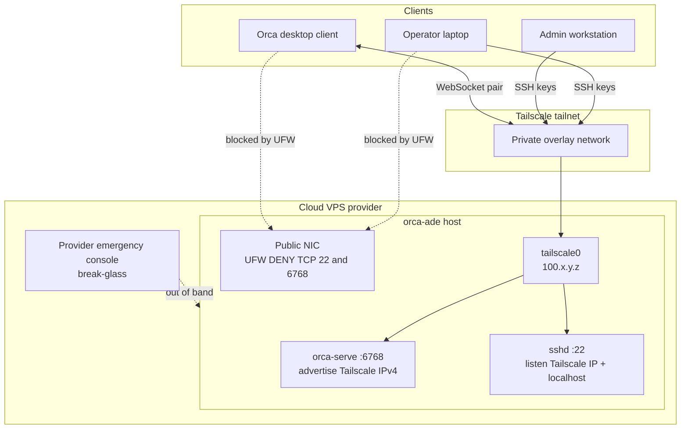

# Architecture (network)

Generic layout produced by [orca-ade-stack](https://github.com/asakaxgit/orca-ade-stack): headless Orca ADE on a cloud VPS, admin and pairing over **Tailscale**, public NIC locked down.

## Traffic rules

| Path | Allowed? |
|------|----------|
| Client → Tailscale IP `:22` (SSH keys) | Yes |
| Orca client → Tailscale IP `:6768` (pairing / runtime) | Yes |
| Internet → public NIC `:22` / `:6768` | No (UFW deny on public interface) |
| Provider console (LISH / serial / VNC equivalent) | Break-glass only |

## Notes

- `orca serve --pairing-address` sets the **advertised** address only. Current AppImages typically still bind `0.0.0.0:6768`; **firewall** is the public exposure control until a bind-host flag exists.
- Scale-out: clone this host pattern (same cloud-init + scripts); each host gets its own Tailscale IP and pairing address.
- Secrets (Tailscale auth keys, tokens, ADC) stay out of this repo — see README.

## Related scripts

1. `scripts/01-tailscale-and-lockdown.sh` — join tailnet, bind SSH, UFW
2. `scripts/02-orca-serve.sh` — AppImage + systemd
3. `scripts/03-dev-toolchains.sh` — nodenv / rbenv / optional agent CLIs
